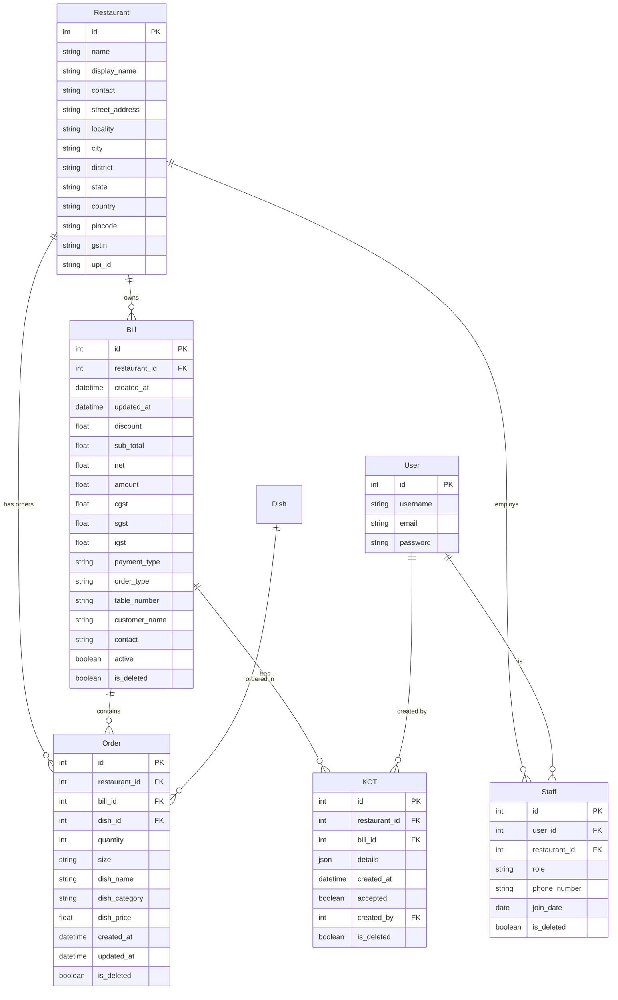

```mermaid
erDiagram
    Restaurant {
        int id PK
        string name
        string display_name
        string contact
        string street_address
        string locality
        string city
        string district
        string state
        string country
        string pincode
        string gstin
        string upi_id
    }

    Staff {
        int id PK
        int user_id FK
        int restaurant_id FK
        string role
        string phone_number
        date join_date
        boolean is_deleted
    }

    Bill {
        int id PK
        int restaurant_id FK
        datetime created_at
        datetime updated_at
        float discount
        float sub_total
        float net
        float amount
        float cgst
        float sgst
        float igst
        string payment_type
        string order_type
        string table_number
        string customer_name
        string contact
        boolean active
        boolean is_deleted
    }

    Order {
        int id PK
        int restaurant_id FK
        int bill_id FK
        int dish_id FK
        int quantity
        string size
        string dish_name
        string dish_category
        float dish_price
        datetime created_at
        datetime updated_at
        boolean is_deleted
    }

    KOT {
        int id PK
        int restaurant_id FK
        int bill_id FK
        json details
        datetime created_at
        boolean accepted
        int created_by FK
        boolean is_deleted
    }

    User {
        int id PK
        string username
        string email
        string password
    }

    Restaurant ||--o{ Bill : "owns"
    Restaurant ||--o{ Order : "has orders"
    Restaurant ||--o{ Staff : "employs"
    Bill ||--o{ Order : "contains"
    Bill ||--o{ KOT : "has"
    User ||--o{ Staff : "is"
    User ||--o{ KOT : "created by"
    Dish ||--o{ Order : "ordered in"
```
